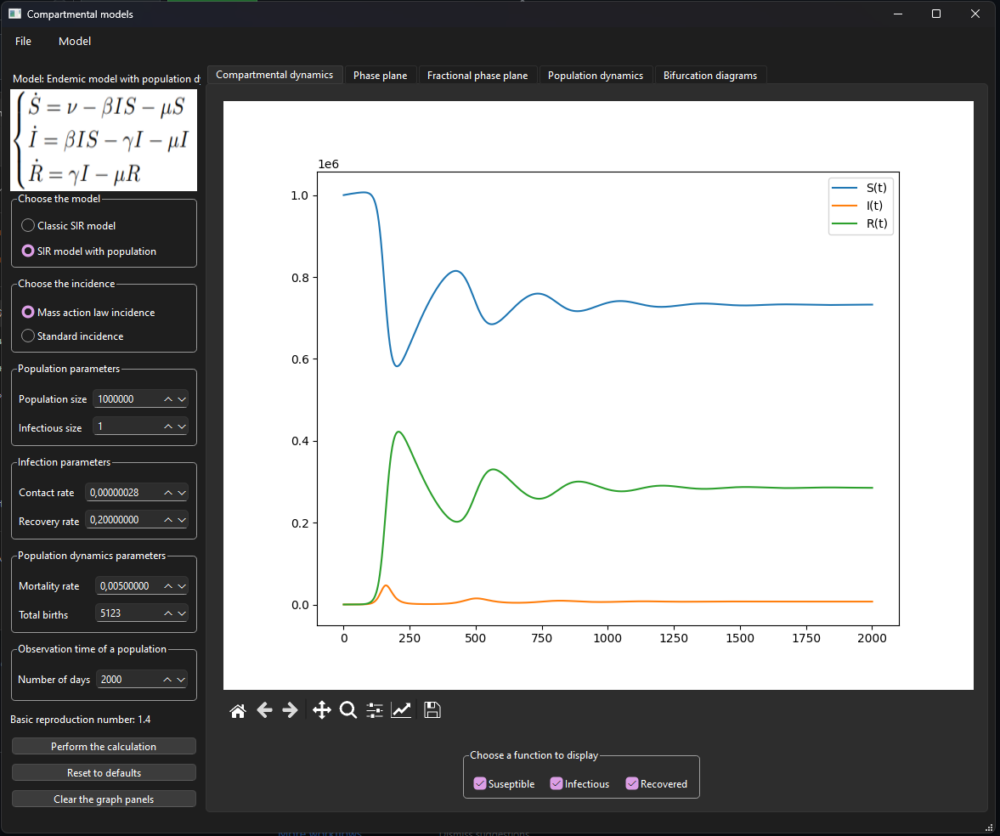

# Программный комплекс для демонстрации динамики SIR-системы

Программный комплекс предназначен для визуализации и анализа динамики **SIR-системы** — одной из базовых моделей распространения инфекционных заболеваний.  
Модель позволяет наблюдать изменение числа восприимчивых (S), инфицированных (I) и выздоровевших (R) особей во времени.

---

## Интерфейс программы

---

## Стек технологий

- **Python 3**
- **PySide6** — графический интерфейс
- **NumPy** — численные вычисления
- **Matplotlib** — построение графиков

---

## Описание

Пользователь может изменять параметры модели (например, скорость заражения и выздоровления) и наблюдать, как эти изменения влияют на поведение системы во времени.  
